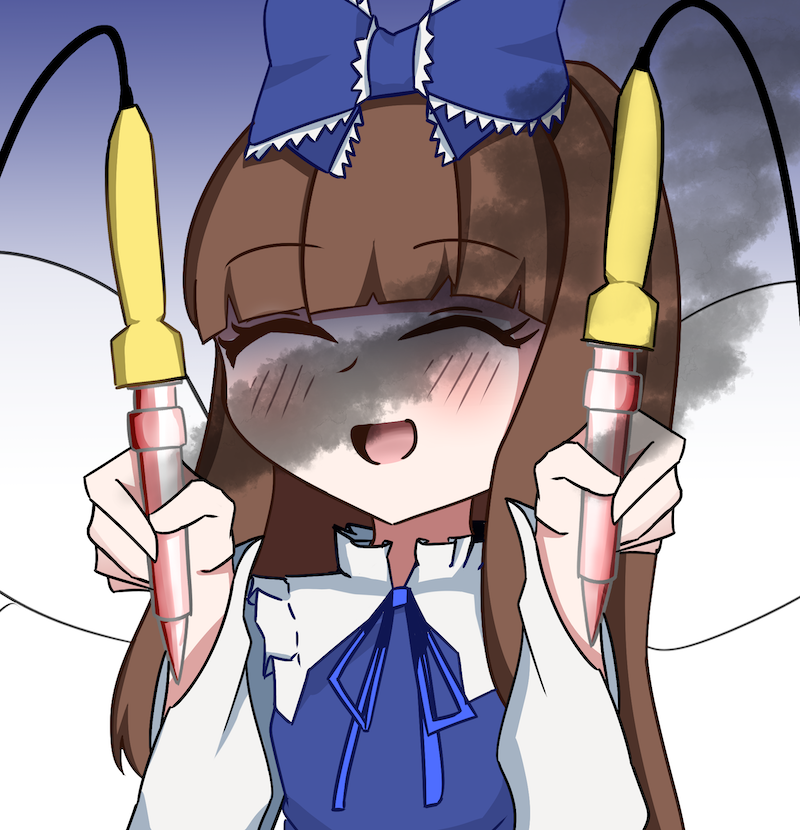

## Hi there 👋
<p> 本アカウント管理者のケン(ken)です！<br>
My name is Ken (ケン), and I am the owner of this account!<br>
光の三妖精はセットじゃない！！！！！！<br>
Three Fairies of Light isn't one set!!!!!!</p>


## About
<p> 使用言語パイ等は以下の通りになります。<br>
I'm using the following programming language.<br></p>
<p align="left">
  <a href="https://github.com/nokoken">
    
  </a>
  <a href="https://github.com/nokoken">
    
  </a>
</p>


## Trophy


## Introduce

``` yaml
name: ケン/ken
age: 21
birthday: 03/25
hobbies:
  - programming
  - watching animes
  - reading lightnovels
  - mathematics
  - electronic work
  - playing games
  - karaoke
  - The Touhou Project
programming:
  languages:
    JavaScript:
        学習し始めて最初に触ったプログラミング言語。最近はあんまり使ってない。 
        It was the first programming language. I learned, but I haven't used It much recently.
    C#: 
        学部にて最初に習った言語。Unity触る時にはこれを使う。一番触ってる言語
        It was the first programming language I learned during my bachelor's degree. It's useful when working with Unity and similar tools. I use this language the most.
    Python:
        C#をやった後にやり始めた言語。あんまり好きではない
        After working with C#, I started this. I don't really like it...
    C:
        組み込みエンジニアに憧れて勉強した言語。実務経験あり。結構好き。
        I did it because I wanted to be an embedded engineer. I have practical experience
    C++: 
        競技プログラミングするときに触る言語。やればやるほど味が出てくるので結構好き。
        I am working with Competitive Programming. I like it because It's deep.
    Ruby: 
        1年生の時、インターンにて少し触った言語。はっきり言って嫌い。
        This is a language that I had some exposure to during an internship during my first year. I hate it!
    PHP: 
        PHP自体に思入れはない。Laravelは好き
        I don't have feelings for PHP but I like Laravel.
    TypeScript:
        Reactを最近触り始めたのでついでに使っている
        I am working with React and I am using it.
    Haskell:
        研究にて圏論理解のために触ってる。結構好き
        I'm using it in my research to better understand category theory. I like Haskell.
  Editors:
    VSCode:
        定番。
        This is normal.
    Vim:
        VSCode開くのが面倒くさい時によく使う
        I often use it when I don't feel like opening VSCode.
  Other:
    HTML/CSS:
        20万ほどでHP作った経験あり
        I have experience creating a website for around.
    React:
        現在サークルのホームページ作りに使用中
        I am using it for my club website. 
    Unity:
        自分の好きなキャラクターが主人公の作品を作るのに1年くらい使った。
        I created a work in which your favorite charactor is the protagonist. It took a year.
affiliation:
  - OECUプログラミングサークル 元副代表/現補佐
  - 東方電通録 現補佐
  - 東方永萃地
  - 上善研究室デジタルゲーム学科
accounts:
  Email: ken0325kame@gmail.com
  Twitter: @33363376_KR
  Discord: ken3268
  AtCoder: nokoken
  Qiita: @nokoken
```